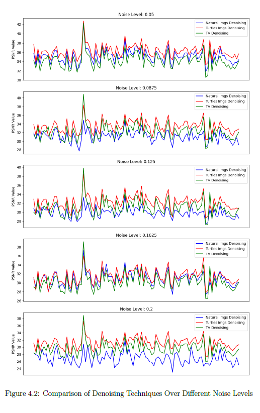
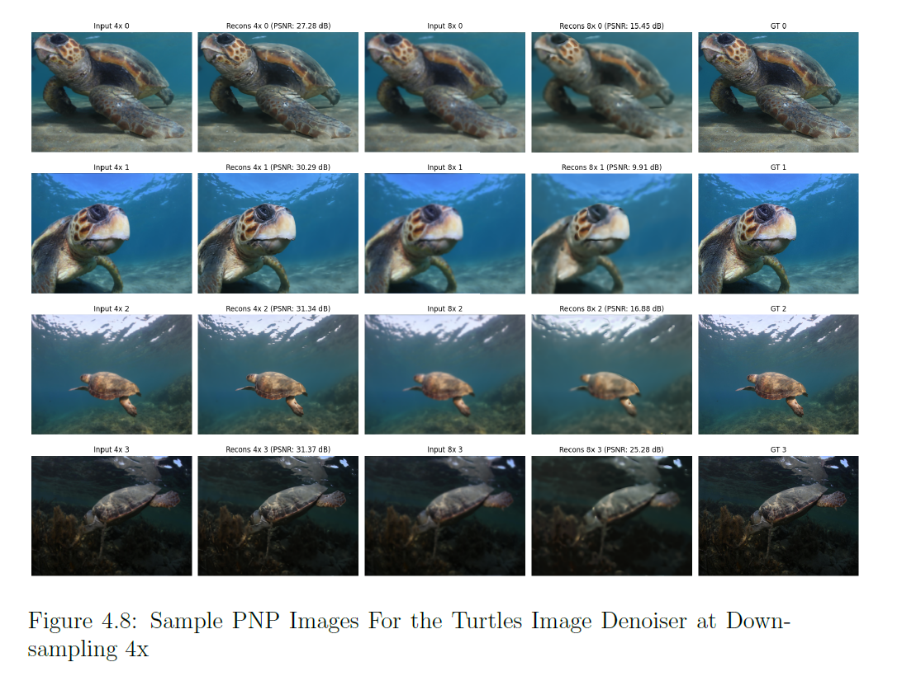

# Image-Super-Resolution-with-Plug-and-Play

This project explores different image reconstruction techniques, including denoising, deblurring, and image super-resolution. These techniques are applied
to a Sea Turtles dataset. The primary objective was to implement the
Plug-and-Play Alternating Direction Method of Multipliers (ADMM) framework
for image super-resolution, by using different denoisers in the data
fidelity step. An initial experiment was done to design a convolutional neural
network (CNN) in an encoder-decoder style and train it as a denoiser on
the Sea Turtles dataset. The model was then tested on the same dataset to
assess its performance. Subsequently, the same CNN denoiser was trained
on a natural images dataset and tested on the Sea Turtles dataset to compare
generalization capabilities. Furthermore, a traditional total variation
denoiser was also used to evaluate its effectiveness against the CNN-based
denoisers. To identify the optimal approach the performance of these models
was compared across various noise levels from 0.05-0.2. The DeepInverse library
was used to facilitate the experiments and manage the reconstruction
tasks, demonstrating that dataset-specific denoisers trained on targeted images,
such as the Sea Turtles dataset, offer superior performance in denoising
and super-resolution compared to generalized models.

Turtle images dataset: https://www.kaggle.com/datasets/wildlifedatasets/seaturtleid2022
Natural Images dataset: https://www.kaggle.com/datasets/prasunroy/natural-images

All Code files are in the scripts folder and contain the following:

1. Image_denoising_results.ipynb:
A Jupyter Notebook that contains the results of the image-denoising experiments. This notebook includes code for loading images, applying denoising techniques, and visualizing the results.

2. Turtles_images_denoiser_training:
A Python script for training a denoising model on Turtles images with noise levels 0.05-0.2. The script includes data preprocessing, model architecture definition, and training loop implementation.

3. Natural_images_denoiser_training:
A Python script for training a denoising model on natural images with noise levels 0.05-0.2. The script includes data preprocessing, model architecture definition, and training loop implementation.

4. PnP_noise_0.05_downsample_4x.py:
A Python script that implements the Plug-and-Play (PnP) denoising method with a noise level of 0.05 and a downsampling factor of 4x. This script demonstrates the application of the PnP method on noisy images and evaluates its performance. This is done using the deepinverse library. The noise level, downsampling factor, and denoiser used were changed in this file to get results for a range of noise levels, downsampling factors, and 2 different denoisers. 

5. Grid_search_TV:
This file contains the Grid search done to find the best ths value for the Total Variance Denoising used in the Image_denoising_results file
